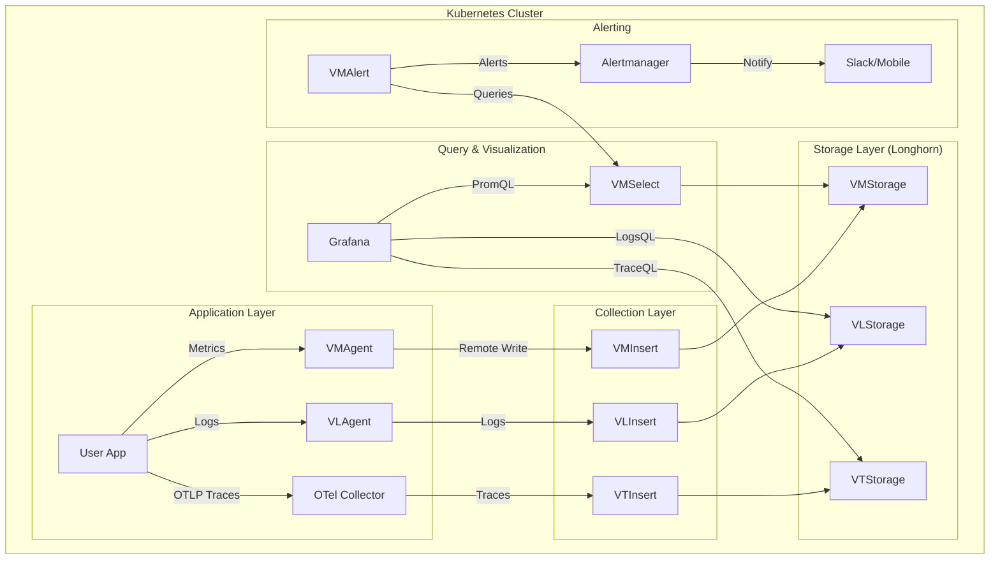

# Monitoring Architecture Deep Dive

This document details the high-availability (HA) modular architecture of our VictoriaMetrics-based observability stack.

## Architecture Diagram



## Component Breakdown

### 1. VictoriaMetrics Operator (The Administrator)
The **Operator** is a Kubernetes controller that acts as an automated system administrator. It manages the lifecycle of all VM components. Instead of manually creating StatefulSets or ConfigMaps, we define our intent (e.g., "I want a cluster with 2 storage nodes") using CRDs, and the operator handles the actual implementation and maintenance.

### 2. VMCluster (Metrics)
Our Metrics engine is split for maximum scalability:
- **VMInsert**: The "Receptionist". It receives data and distributes it across storage nodes.
- **VMSelect**: The "Analyst". It executes PromQL/MetricsQL queries.
- **VMStorage**: The "Warehouse". Stores the data on Longhorn.

### 3. VictoriaLogs & VictoriaTraces
- **VictoriaLogs**: High-performance log storage. It's more resource-efficient than Loki/Elasticsearch and integrates with LogsQL.
- **VictoriaTraces**: Native OpenTelemetry (OTLP) trace storage. It allows tracking requests across microservices.

### 4. OpenTelemetry (OTel) Integration
OTel is our **Universal Language**. Apps instrumented with OTel SDKs send data via **OTLP** protocol. This ensures our setup is vendor-neutral; we can swap storage backends without changing a single line of application code.

### 5. Alerting: vmalert & Alertmanager
We split alerting into two phases:
- **vmalert (Evaluation)**: It acts as the "Brain" that constantly checks rules against `VMSelect`.
- **Alertmanager (Notification)**: It acts as the "Mouth" that groups, silences, and routes alerts to Slack, Discord, or Email. They are not rivals; they are a team.

## Application Integration Patterns

To monitor applications in this cluster, you have three primary integration patterns:

### 1. Prometheus Operator CRDs (Recommended)
Our stack includes a **Prometheus Converter**. If an application or operator (like `CloudNativePG`) creates a `ServiceMonitor` or `PodMonitor`, VictoriaMetrics Operator automatically converts it into a `VMServiceScrape` or `VMPodScrape`. 
- **Example**: `CloudNativePG` with `enablePodMonitor: true` works out-of-the-box.

### 2. OpenTelemetry (OTLP)
For modern applications, send Metrics, Logs, and Traces directly to the VMAgent OTLP endpoint.
- **Endpoint**: `vmagent.monitoring.svc:8429` (Metrics)
- **Endpoint**: `vlogs.monitoring.svc` (Logs)
- **Endpoint**: `vtraces.monitoring.svc` (Traces)

### 3. Annotation-based Discovery
For simple applications, add standard Prometheus annotations to your Pods:
```yaml
annotations:
  prometheus.io/scrape: "true"
  prometheus.io/port: "8080"
```
VMAgent is configured with `selectAllByDefault: true`, ensuring it automatically discovers these targets.

## Storage Locality (Longhorn)
All components use **Longhorn** with `StorageClass` specific to their needs. For database metrics (like Postgres), we ensure the monitoring data itself is stored on highly available Longhorn volumes, providing a resilient audit trail even during node failures.
