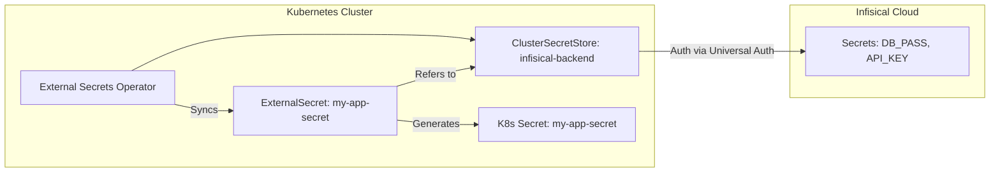

# External Secrets Operator (ESO) + Infisical Integration

This component implements a production-grade secret management system for the homelab cluster. It decouples secret storage from the Git repository by fetching sensitive data at runtime from **Infisical Cloud** and injecting it as native Kubernetes Secrets.

## Overview

- **Storage Backend**: Infisical Cloud (SaaS)
- **Authentication**: Universal Auth (Machine Identity)
- **Abstraction Layer**: External Secrets Operator (ESO) v2.4.1
- **Environment**: `homelab`

> [!IMPORTANT]
> **CRD Management**: ESO 2.4.1 CRDs are very large (~600KB). We use Kustomize patches to force `ServerSideApply=true` on these CRDs to bypass the 256KB annotation limit, ensuring stable syncs in ArgoCD.

## Architecture

We use the **ClusterSecretStore** pattern, which provides a global secret provider accessible by all namespaces in the cluster. This allows applications to define `ExternalSecret` resources in their own namespaces without needing individual credentials for Infisical.



## Prerequisites (One-time Setup)

Before this component can sync secrets, you must perform a manual bootstrap of the Infisical Machine Identity credentials.

### 1. Infisical Cloud Setup
1. Create a Project and an environment named `homelab`.
2. Go to **Access Control > Machine Identities**.
3. Create a new identity with **Universal Auth** (e.g., `homelab-eso`).
4. Assign a role that has `Read` access to the `homelab` environment.
5. Note the **Client ID**, **Client Secret**, and **Project Slug**.

### 2. Kubernetes Bootstrap
Run the following commands to provide the "initial spark" to the cluster:

```bash
# Create the namespace
kubectl create namespace external-secrets

# Create the auth secret
kubectl create secret generic infisical-auth \
  --from-literal=clientId="YOUR_CLIENT_ID" \
  --from-literal=clientSecret="YOUR_CLIENT_SECRET" \
  -n external-secrets
```

## Configuration

### Project Slug Update
You **MUST** update the `projectSlug` in [infisical-cluster-store.yaml](infisical-cluster-store.yaml) with your actual Infisical Project Slug:

```yaml
secretsScope:
  projectSlug: "your-project-slug-here"
```

## Usage Example

To use a secret in your application, create an `ExternalSecret` resource:

```yaml
apiVersion: external-secrets.io/v1beta1
kind: ExternalSecret
metadata:
  name: my-app-secrets
  namespace: my-app-ns
spec:
  refreshInterval: "1h"
  secretStoreRef:
    kind: ClusterSecretStore
    name: infisical-backend
  target:
    name: k8s-secret-name
  data:
    - secretKey: DB_PASSWORD
      remoteRef:
        key: INFISICAL_SECRET_NAME
```

## Troubleshooting

- **Check ESO Status**: `kubectl get pods -n external-secrets`
- **Check Store Health**: `kubectl describe clustersecretstore infisical-backend`
- **Check Secret Sync**: `kubectl describe externalsecret <name> -n <namespace>`

## References

- [Infisical Documentation](https://infisical.com/docs/documentation/getting-started/introduction)
- [External Secrets Operator Docs](https://external-secrets.io/latest/provider/infisical/)
