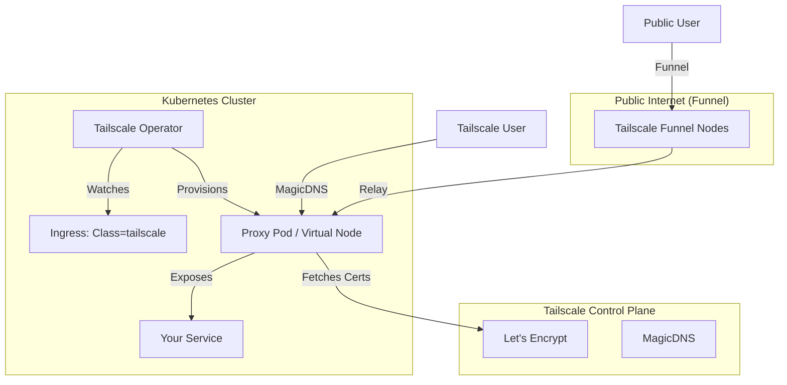

# 🛡️ Tailscale Kubernetes Operator: Complete Guide

This guide provides a comprehensive, step-by-step walkthrough for deploying and managing the Tailscale Kubernetes Operator. Following the **East4Ming Philosophy**, we achieve Zero-Trust connectivity, Zero Port Forwarding, and Automated SSL for your homelab.

---

## 🏗️ Architecture & The "Magic"

The Tailscale Operator acts as a bridge between your Kubernetes cluster and your private **tailnet**. It eliminates the need for complex Nginx Ingress configurations, manual port forwarding, and traditional `cert-manager` setups.



---

## 📋 Prerequisites

Before starting, ensure the following components are functional in your cluster:
1. **ArgoCD**: For GitOps-driven deployment.
2. **External Secrets Operator (ESO)**: To sync secrets from Infisical.
3. **Infisical**: Configured as the backend for `ClusterSecretStore` (`infisical-backend`).

---

## 1️⃣ Part One: Tailscale Admin Console Setup

### A. Configure Access Control (ACLs)
The operator needs specific permissions to manage devices and tags. Navigate to your **[Tailscale Access Control](https://login.tailscale.com/admin/acls/file)** and add these definitions:

```json
{
  "tagOwners": {
    "tag:k8s-operator": ["your-admin-email@example.com"],
    "tag:k8s":          ["tag:k8s-operator"]
  },
	"nodeAttrs": [
		{
			"target": ["autogroup:member"],
			"attr":   ["funnel"],
		},
		{
			"target": ["tag:k8s"],
			"attr":   ["funnel"],
		},
	],
}
```
> [!NOTE]
> `tagOwners` establishes the identity for the operator, while `nodeAttrs` enables **Tailscale Funnel** for public ingress.

### B. Generate OAuth Credentials
[Create an OAuth client](https://tailscale.com/docs/features/oauth-clients#setting-up-an-oauth-client) in the [Trust credentials](https://login.tailscale.com/admin/settings/trust-credentials) page of the admin console. Create the client with Devices Core, Auth Keys, Services write scopes, and the tag tag:k8s-operator.

1. Go to **Settings** -> **Trust credentials**
2. Select the **Credential** button.
3. Select **OAuth**.
4. **Set Scopes:** Select **Read & Write** for:
   - [x] **Devices core**
   - [x] **Auth Keys**
   - [x] **Services**
5. **Assign Tag:** Under the **Tags** dropdown, select **`tag:k8s-operator`**.
5. Click **Generate client**.
6. **SAVE THESE:** Copy the **Client ID** and **Client Secret**. You will need them for Infisical.

---

## 2️⃣ Part Two: Secret Management (Infisical)

We use **Infisical** and **External Secrets Operator** to securely inject credentials without committing them to Git.

1. Log in to your **Infisical Cloud** instance.
2. Navigate to your project and environment (e.g., `prod`).
3. Add the following secrets:
   - `TAILSCALE_OPERATOR_CLIENT_ID`: Your OAuth Client ID.
   - `TAILSCALE_OPERATOR_CLIENT_SECRET`: Your OAuth Client Secret.

The `external-secret.yaml` in this directory will automatically sync these to a Kubernetes Secret named `operator-oauth`.

---

## 3️⃣ Part Three: Automated SSL & MagicDNS

Tailscale automates the Let's Encrypt lifecycle via **MagicDNS**.

1. Go to **Settings** -> **[DNS](https://login.tailscale.com/admin/settings/dns)** in the Admin Console.
2. Ensure **MagicDNS** is **Enabled**.
3. Scroll down to **HTTPS Certificates** and click **Enable**.

---

## 4️⃣ Part Four: Core Features (Ingress & Egress)

### 🚀 Cluster Ingress (Expose K8s to Tailnet)
Expose a service (like ArgoCD) to your private tailnet with valid SSL:

```yaml
apiVersion: networking.k8s.io/v1
kind: Ingress
metadata:
  name: argocd-server-ingress
  namespace: argocd
  annotations:
    tailscale.com/hostname: "argocd"
    # tailscale.com/funnel: "true" # Uncomment to expose to the public internet
spec:
  ingressClassName: tailscale
  tls: [{ hosts: ["argocd"] }]
  rules:
    - http:
        paths:
          - path: /
            pathType: Prefix
            backend:
              service: { name: argocd-server, port: { number: 80 } }
```

### 🛰️ Cluster Egress (Expose Tailnet to K8s)
Allows pods in your cluster to reach services on your tailnet (e.g., a NAS or a database on another machine).

```yaml
apiVersion: v1
kind: Service
metadata:
  name: nas-service
  annotations:
    tailscale.com/tailnet-fqdn: "nas.your-tailnet.ts.net"
spec:
  type: ExternalName
  externalName: unused # The operator will proxy this
```

---

## 5️⃣ Part Five: Advanced Capabilities

### 🌉 Connector (Subnet Router & Exit Node)
Turn your Kubernetes cluster into a gateway for your home network or an exit node for secure browsing.

```yaml
apiVersion: tailscale.com/v1alpha1
kind: Connector
metadata:
  name: subnet-router
spec:
  subnetRouter:
    advertiseRoutes:
      - "10.0.0.0/24"
  # exitNode: true # Uncomment to enable exit node functionality
```

### 📱 App Connector (Zero-Trust SaaS Access)
Route traffic to specific domains (e.g., internal admin panels or SaaS apps) through your cluster for enhanced security.

```yaml
apiVersion: tailscale.com/v1alpha1
kind: AppConnector
metadata:
  name: internal-apps
spec:
  domains:
    - "admin.example.com"
```

### 📡 Multi-Cluster Ingress
Deploy a global service across multiple clusters with a single Tailscale hostname. Traffic is automatically routed to the nearest healthy cluster.

```yaml
apiVersion: tailscale.com/v1alpha1
kind: MultiClusterIngress
metadata:
  name: global-app
spec:
  clusters:
    - name: cluster-east
    - name: cluster-west
  hostname: "global-app"
```

### 🔐 API Server Proxy
This deployment has `apiServerProxyConfig` enabled. It allows you to access your Kubernetes API server directly over Tailscale.

- Reachable at: `https://<tailscale-hostname>.<your-tailnet>.ts.net`
- Perfect for **Multi-cluster ArgoCD** setups.

---

## 🔍 Verification & Troubleshooting

### Check Synchronization
```bash
# 1. Verify External Secret (Should be 'SecretSynced')
kubectl get externalsecret operator-oauth -n tailscale

# 2. Verify Operator Pods
kubectl get pods -n tailscale
```

### Check Advanced Resources
```bash
kubectl get connectors
kubectl get appconnectors
kubectl get multiclusteringresses
```

---

## 📚 Resources
- [Tailscale API Server Proxy](https://tailscale.com/docs/features/kubernetes-operator/how-to/api-server-proxy)
- [Cluster Egress Guide](https://tailscale.com/docs/features/kubernetes-operator/how-to/cluster-egress)
- [Subnet Routers on K8s](https://tailscale.com/docs/features/kubernetes-operator/how-to/connector)
- [App Connectors](https://tailscale.com/docs/features/kubernetes-operator/how-to/app-connector)
- [Multi-cluster ArgoCD](https://tailscale.com/docs/solutions/manage-multi-cluster-kubernetes-deployments-argocd)
